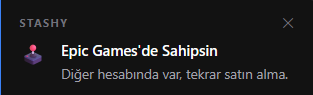
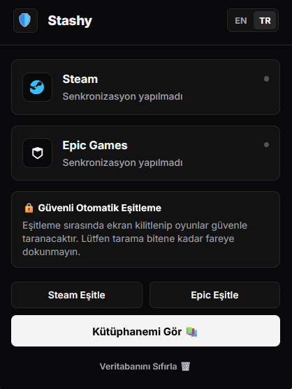
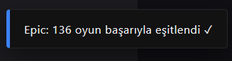
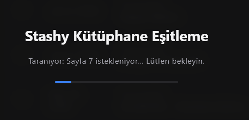

<div align="center">
  
  <h1>Stashy</h1>
  <p>A secure, offline-first browser extension that compares Steam and Epic Games libraries, displaying minimalist "Bento Grid" HUD cards directly on product store pages to prevent accidental double purchases.</p>
  
  <a href="https://addons.mozilla.org/tr/firefox/addon/stashy/">
    
  </a>
  <a href="https://www.buymeacoffee.com/blosny">
    
  </a>
</div>

---

## 🌟 What's New in V3 (v1.4.0)
- **Bento Grid UI**: A complete visual overhaul featuring a sleek, solid anthracite (`#121212`) minimalist design inspired by Playnite.
- **Dynamic Localization**: Full Bilingual Support (English & Turkish) that dynamically applies to menus, the library, and scanning overlays.
- **SPA Watcher**: Perfected single-page application (SPA) support for the Epic Games store, triggering badges instantly without manual refreshes.

## 📸 Screenshots

| Extension Dashboard | Library Grid |
| :---: | :---: |
|  |  |
| **Store Notification Badge** | **Scanning Overlay** |
|  |  |

## 🚀 Key Features

* **Zero-Click Passive Sync:** Browse your Steam Games list or Epic Transactions page, and Stashy securely indexes your library in the background.
* **Base Game & DLC Guard:** Automatically compares titles and triggers clean alerts if you own a base game but are viewing an expanded bundle.
* **100% Private & Local:** Zero external server connections, zero data collection, and zero credentials required. All data remains strictly inside your browser sandbox (`chrome.storage.local`).
* **Cross-Platform:** Works natively on Chromium (Chrome, Edge, Brave) and Gecko (Firefox, Zen Browser) engines.

---

## 🛠️ Installation

### 🦊 Firefox (Recommended)
Download directly from the [Mozilla Add-ons Store](https://addons.mozilla.org/tr/firefox/addon/stashy/).

### 🌈 Chrome, Edge & Brave (Manual Install)
1. Download the latest `stashy-v1.4.0.zip` from the Releases tab (or clone this repository).
2. Extract the ZIP file to a folder.
3. Open your browser and navigate to `chrome://extensions/` (or `edge://extensions/`).
4. Toggle the **"Developer mode"** switch in the top right.
5. Click **"Load unpacked"** in the top left.
6. Select the extracted `stashy` project folder.

---

## 🧠 Architecture Overview

Stashy operates entirely in the user space inside the local browser sandbox. It utilizes content scripts to read game catalog tables and inject reactive CSS overlays, a central service worker to coordinate normalization/matching, and native storage to maintain game databases.

```text
       +--------------------------------------------------------+
       |                  Active Browser Tabs                   |
       +──────────────────────────┬─────────────────────────────+
                                  │
         (DOM Scraping)           │ (DOM Hydration / Injection)
         Scrape Game Lists        │ Solid Matte HUD Badges
                                  ▼
                    +───────────────────────────+
                    |      Content Scripts      |
                    |   * content/badge.js      |
                    |   * steam-library.js      |
                    |   * epic-library.js       |
                    +─────────────┬─────────────+
                                  │
                                  │ Runtime Messages
                                  ▼
                    +───────────────────────────+
                    | Background Service Worker |
                    |      * background.js      |
                    +─────────────┬─────────────+
                                  │
                                  │ Local Read/Write Operations
                                  ▼
                    +───────────────────────────+
                    |      Browser Sandbox      |
                    |   * chrome.storage.local  |
                    +───────────────────────────+
```

## 🔐 Security Pillars
* **Zero Cloud Connections:** The extension executes 100% offline. No telemetry, analytical beacons, or platform endpoints are ever pinged.
* **No Authentication Tokens:** The system does not request Steam API Keys or Epic Games account credentials.
* **Sandbox Isolation:** Game databases are strictly stored in local sandboxed key-value tables.

## 🤝 Contribution
Contributions are welcome! Feel free to open issues or submit pull requests.
